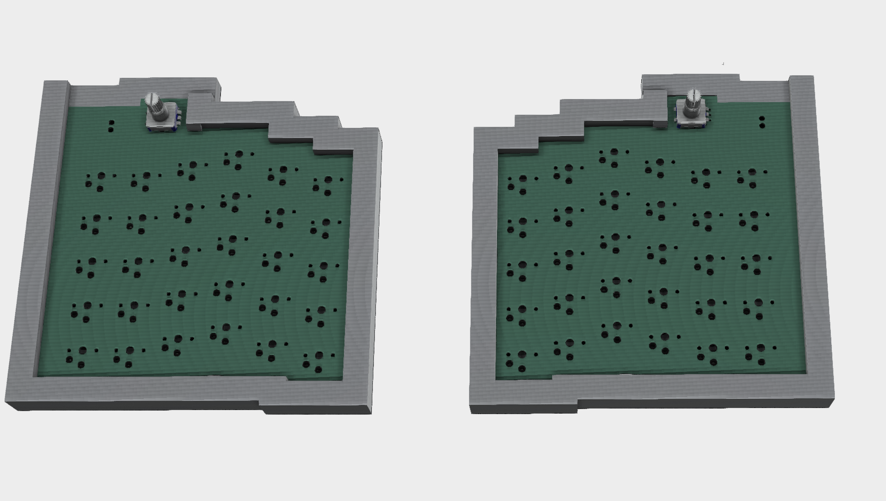

# Bluekeeb

A custom made low-profile mechanical keyboard that uses a XIAO seeed module as the controller, a master-slave implementation of the firmware, that uses ZMK. Hassles with batteries can be avoided, due to the battery management and charging systems of the XIAO module in use. I have made the decision to remove the row of function keys, and replace them with a rotary encoder on the right side that controls music volume, and on the left side, a rotary encoder that controls the brightness of your display.

## How I made this

I made this using the OPL Kicad Library, running Kicad 8.0 on Windows 11. I have compiled it all to a manufacturable gerbers.zip file containing all the important info. I have a rotary encoder, which I'm planning to use a standard, 11 millimeter ec11 rotary encoder. Along with that, I'm going to use Choc v1 Kailh key switches, paired with custom 3d-printed keycaps. 

## Why did I make this

I made it because I was bored, and then I ended up spending a lot of time on it I guess? Also to qualify for stasis.hackclub.com's hackathon in Austin, TX.

## Assembled PCB (without the case and keycaps)

## PCB

## Schematic

## Case + PCB + electronics

Actually, while I was using freecad, after I had the whole thing set up, It didn't let me export or import files, even though I was trying to import/export supported file formats. I was only able to get the case, rotary encoders, and the PCB to show up on the render. 

The newer case (Bluekeeb case.step, not bluekeeb.step) is a newer version of the case that I am going to print out myself, as well as ordering all the components myself. The cases has a slot open for the usb c cable connection coming from the XIAO module.

|                              |                      |                    |                         |             | shipping on pcb causes it to jump in price so much. Shipping costs $17.81                                                              |               |                                                                                                                                                                                                                                                                                     |                                                                   |
|------------------------------|----------------------|--------------------|-------------------------|-------------|----------------------------------------------------------------------------------------------------------------------------------------|---------------|-------------------------------------------------------------------------------------------------------------------------------------------------------------------------------------------------------------------------------------------------------------------------------------|-------------------------------------------------------------------|
| Item                         | Description          | Quantity           | Unit Price              | Total Price | Total (with tax & shipping incl.)                                                                                                      | Running Total | Link                                                                                                                                                                                                                                                                                |                                                                   |
| PCB                          | PCB from jlcpcb      | 5 (jlcpcb minimum) | $16.30                  | $16.30      | $36.41                                                                                                                                 | $36.41        | https://cart.jlcpcb.com/quote                                                                                                                                                                                                                                                       | Cheapest PCB quote I could find                                   |
| Kailh Choc v1 (70pcs)        | Low profile switches | 1                  | $18.25                  | $18.25      | $20.21                                                                                                                                 | $56.62        | https://www.ebay.com/itm/157157330062                                                                                                                                                                                                                                               | Cheaper than on AliExpress                                        |
| Seeed Studio XIAO nRF52840   | MCU                  | 2                  | $9.99                   | $19.98      | $22.39                                                                                                                                 | $79.01        | https://www.amazon.com/gp/product/B0C6Q67V97?smid=A1YZW40LYQY3L1&psc=1                                                                                                                                                                                                              | Cheaper than AliExpress including shipping using holiday discount |
|                              |                      |                    |                         |             | The Seeed Studio price is discounted by $5 (price includes discount). If I order after the 31st of December, the price will be $27.93. |               |                                                                                                                                                                                                                                                                                     |                                                                   |
| Hot Swaps (50pcs)            | Sockets for Choc v1s | 1                  | $5.50                   | $5.50       | (AliExpress)                                                                                                                           | $79.01        | https://www.aliexpress.us/item/3256806423843004.html?spm=a2g0o.cart.0.0.47a538daYBbt9U&mp=1&pdp_npi=5%40dis%21USD%21USD%2011.46%21USD%205.50%21%21USD%205.50%21%21%21%40210328db17669560346357255e1c7d%2112000037825583671%21ct%21US%216953170698%21%211%210&gatewayAdapt=glo2usa   |                                                                   |
| Hot Swaps (30pcs)            | Sockets for Choc v1s | 1                  | $0.99 welcome discount) | $0.99       | (AliExpress)                                                                                                                           | $79.01        | https://www.aliexpress.us/item/3256802980434588.html?spm=a2g0o.cart.0.0.47a538daYBbt9U&mp=1&pdp_npi=5%40dis%21USD%21USD%205.63%21USD%200.99%21%21USD%200.97%21%21%21%40210328db17669560346357255e1c7d%2112000024451955236%21ct%21US%216953170698%21%211%210&gatewayAdapt=glo2usa    |                                                                   |
| 1N4148W (100pcs)             | Diodes               | 1                  | $1.48                   | $1.48       | (AliExpress)                                                                                                                           | $79.01        | https://www.aliexpress.us/item/3256807716771073.html?spm=a2g0o.cart.0.0.47a538daYBbt9U&mp=1&pdp_npi=5%40dis%21USD%21USD%201.48%21USD%201.48%21%21USD%201.48%21%21%21%40210328db17669560346357255e1c7d%2112000042781108223%21ct%21US%216953170698%21%211%210&gatewayAdapt=glo2usa    |                                                                   |
| 3.7V LiPo batteries (2-pack) | 1000mah Battery      | 1                  | $10.66                  | $10.66      | $18.61 (total for AliExpress)                                                                                                          | $97.62        | https://www.aliexpress.us/item/3256803193874231.html?spm=a2g0o.cart.0.0.47a538datUX9yB&mp=1&pdp_npi=5%40dis%21USD%21USD%2015.23%21USD%2010.66%21%21USD%2010.66%21%21%21%402103126e17669575315265295e8fbd%2112000032368701982%21ct%21US%216953170698%21%211%210&gatewayAdapt=glo2usa |                                                                   |

(I will purchase all parts myself, all bits should be going toward qualification :))